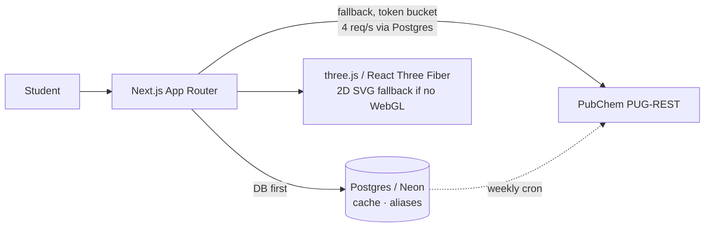

# KAGAKU (科学)

[](https://github.com/minhtai0611/japanese-aesthetic-chemistry-simulation/actions/workflows/ci.yml)

A virtual chemistry lab for Vietnamese high-school students, built with Next.js. Real periodic-table data, real 3D molecule geometry, real lab math — nothing simulated by a language model.

**Live:** [japanese-aesthetic-chemistry-simula.vercel.app](https://japanese-aesthetic-chemistry-simula.vercel.app)

## What it does

- **Periodic table** — all 118 elements, rendered as a real semantic `<table>`, each with a detail page sourced live from PubChem
- **3D molecule viewer** — WebGL (three.js) with a Van der Waals surface layer and a click-to-measure Angstrom/degree tool, falling back to a 2D SVG projection when WebGL is unavailable or the user has data-saver mode on
- **Structure search** — by SMILES, IUPAC name, InChIKey, or molecular-weight range
- **Six lab rooms** — titration, dilution, phase change (with a real P–T diagram via Clausius–Clapeyron), equation balancing (exact-rational Gauss–Jordan), reaction thermodynamics (Hess's law), electrochemistry (Nernst equation)

Japanese aesthetic throughout — kanji labels alongside the Vietnamese UI copy.

## Screenshots

| Hero (3D molecule) | Periodic table |
|---|---|
|  |  |

| Titration room | Molecule viewer |
|---|---|
|  |  |

## Data policy

No chemistry value in this app is invented. Everything comes straight from [PubChem PUG-REST](https://pubchem.ncbi.nlm.nih.gov/rest/pug) (NCBI, public, no API key), synced into Postgres on a 7-day cache — pages don't hit PubChem live on every view, which keeps the app under [PubChem's 5 requests/second policy](https://pubchem.ncbi.nlm.nih.gov/docs/pug-rest-tutorial) even across concurrent serverless instances, enforced by a distributed Postgres-backed token bucket (`src/lib/rate-limiter.ts`) rather than a per-process counter.

Everything computed on top of that data — pH, dilution (C₁V₁=C₂V₂), molarity (n=m/M), phase transitions, equation balancing — is a real formula or algorithm, never an estimate and never an LLM call. The reasoning behind each of these decisions is written up in `docs/adr/`.

PubChem itself sometimes can't state a value with certainty — a few superheavy elements have their standard state marked `"Expected to be a ..."` rather than measured, since too few atoms have ever been produced to observe a bulk phase. That uncertainty is carried through the data layer into the UI, which labels those values "predicted" instead of presenting them as settled fact (`docs/adr/0001-tang-do-tin-cay-du-lieu.md`).

## Architecture



## Measured results

Real numbers from this branch, not targets — each row links the command that reproduces it.

| Metric | Before | After | Verify with |
|---|---|---|---|
| 5xx errors across the URL surface | 14 | **0** | `npm run audit:urls` |
| HIGH-severity npm advisories | 12 | **0** | `npm audit --audit-level=high` |
| Vietnamese-alias 500s | 14 / 39 | **0 / 40** | `npm run audit:urls` (alias count has since grown to 40) |
| Unit tests | 0 | **294 passing** | `npm run test` |
| E2E tests (Playwright) | 0 | **6 / 6 passing** | `npm run test:e2e` |
| Equation balancing correctness | — | **50 / 50** | `npm run test` (`equilibrium.test.ts`) |
| Electron configuration correctness | — | **118 / 118** | `npm run test` (`electron-config-118.test.ts`, checked against real PubChem data for every element) |
| Lighthouse Accessibility (all 3 pages) | — | **100 / 100** | see `docs/a11y.md` |
| Lighthouse SEO (all 3 pages) | — | **100 / 100** | `npx @lhci/cli autorun` |
| Lighthouse Performance (WebGL pages) | — | **46–80 / 100** (measured against production, 2026-08-17 — below plan target) | `lighthouse` against the live URL above, see `docs/lighthouse.md` |
| WCAG AA color contrast | 3 pairs failing | **0 / 9 failing** | `python3 scripts/check-contrast.py` |
| JS shipped in data-saver mode | — | **−41.9%** (measured against production, 2026-08-17) | see `docs/a11y.md` §7 |
| Fabricated data points | — | **0**\* | `grep -rn 'padStart(6, *"F")' src` |
| AI/LLM references in application code | — | **0**\* | `grep -rniE "openai\|anthropic\|embedding\|langchain" package.json src` |

\* Both greps match a single line each, but it's a comment explaining why that pattern is *not* used (`src/lib/pubchem.ts` documents why `padStart(6, "F")` was rejected; `src/lib/search.ts` states plainly that it uses no AI/embeddings) — not a real occurrence.

## Stack

- [Next.js](https://nextjs.org) 16 (App Router) + React 19
- [`@react-three/fiber`](https://docs.pmnd.rs/react-three-fiber) / `drei` / `postprocessing` (three.js) for 3D, with an SVG orthographic fallback
- Tailwind CSS 4
- Drizzle ORM + `pg` on Postgres (`DATABASE_URL`)
- TypeScript 5.9, strict mode
- Vitest, Playwright, Lighthouse CI

## Getting started

```bash
npm install
cp .env.example .env   # fill in DATABASE_URL
npm run dev
```

Open [http://localhost:3000](http://localhost:3000).

## Scripts

| Command | Description |
|---|---|
| `npm run dev` | Start the dev server |
| `npm run build` | Production build |
| `npm run start` | Serve the production build |
| `npm run lint` | Lint the codebase |
| `npm run typecheck` | Type-check without emitting |
| `npm run test` | Run the unit test suite (Vitest) |
| `npm run test:cov` | Run tests with coverage |
| `npm run test:e2e` | Run the Playwright E2E suite against a local server |
| `npm run audit:urls` | Crawl the alias/compound/element URL surface for 404s and 5xxs |
| `npm run db:push` | Push the Drizzle schema to Postgres |
| `npx tsx scripts/db-enable-extensions.ts` | One-time: enable `unaccent`/`pg_trgm` on a fresh Postgres, before `db:push` |
| `npx tsx scripts/seed-compounds.ts` | Seed the compound cache/aliases from the real PubChem API (`docs/search.md`) |
| `python3 scripts/check-contrast.py` | Check every text/background color pair against WCAG AA |
| `npx @lhci/cli autorun` | Run Lighthouse CI against `/`, `/periodic-table`, `/compound/caffeine` |

## Project structure

- **`src/app/`** — routes: home, periodic table, element detail; `/compound` and `/compound/[name]` for the 3D viewer (SSR'd, own metadata/canonical/OG image); `/experiments` hub plus one route per lab room; dynamic OG image generation so nothing goes stale; API routes under `src/app/api/*`
- **`src/components/three-d/`** — the 3D scene: hero, compound viewer, molecule mesh, 2D fallback, the Van der Waals shader and Angstrom/degree measurement tool (both lazy-loaded behind an explicit opt-in)
- **`src/components/`** — periodic table, experiments, and compound-viewer UI, grouped per feature
- **`src/lib/pubchem/`** — the only source of chemistry data: PubChem PUG-REST client, split by domain (`core`, `elements`, `compounds`, `conformers`, `suggestions`), plus alias resolution before hitting PubChem
- **`src/lib/chemistry/`** — pure chemistry math: titration, molar mass, exact-rational equation balancing, formula parsing, reaction thermodynamics (Hess's law), P–T phase diagrams (Clausius–Clapeyron), electrochemistry (Nernst equation over real standard-electrode-potential data)
- **`src/lib/search.ts`** — diacritic-insensitive, typo-tolerant compound search over Postgres (`to_tsvector` + `pg_trgm`, no AI), with a PubChem-autocomplete fallback
- **`src/db/schema.ts`** — Drizzle schema for the cache/search layer
- **`docs/adr/`** — architecture decision records for the calls that aren't obvious from the code
- **`tests/unit/`** (Vitest) and **`tests/e2e/`** (Playwright) — see the metrics table above for current pass counts

## Deployment

Hosted on [Vercel](https://vercel.com) (Hobby tier) with [Neon](https://neon.tech) Postgres. Pushes to `master` auto-deploy. A weekly cron job (`vercel.json`) re-syncs the compound cache; `CRON_SECRET` gates it so only Vercel Cron can trigger it.

## License

Code: MIT (`LICENSE`).

**The chemistry data itself isn't this project's to license.** Every element and compound value comes from [PubChem](https://pubchem.ncbi.nlm.nih.gov) (NCBI/NIH), U.S. government public-domain data. KAGAKU doesn't modify, interpolate, or add measured values of its own.
