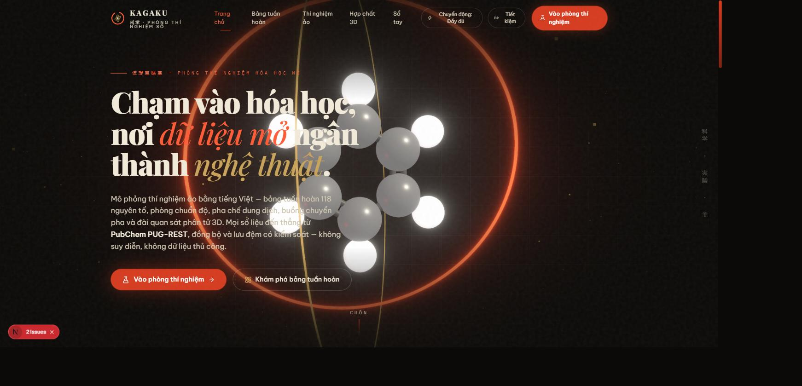
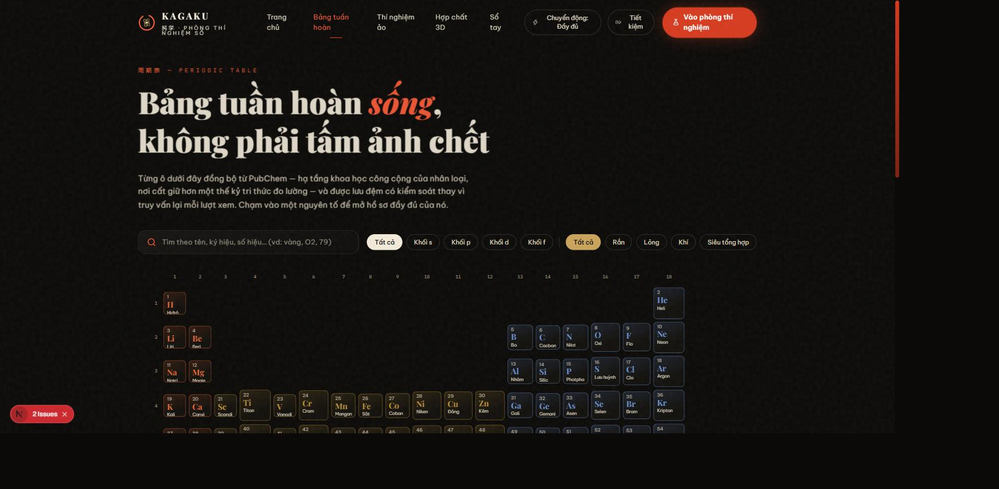
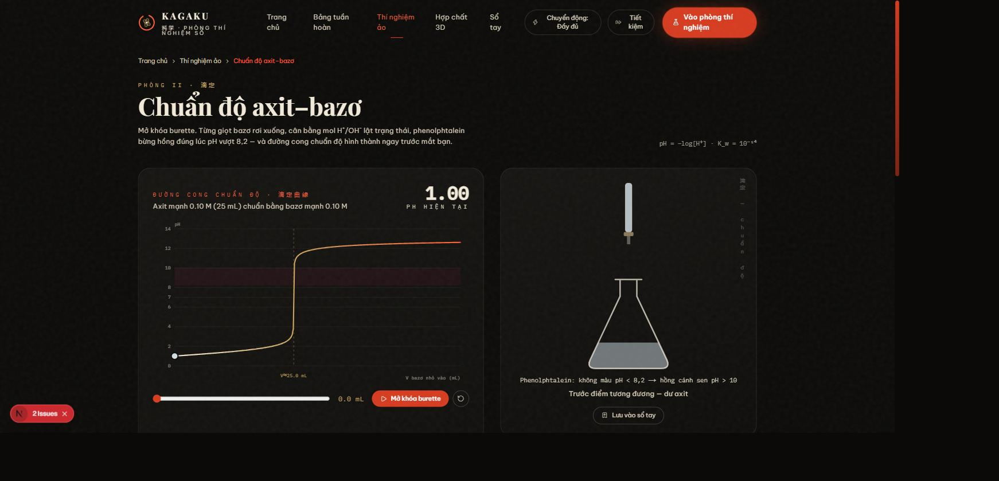
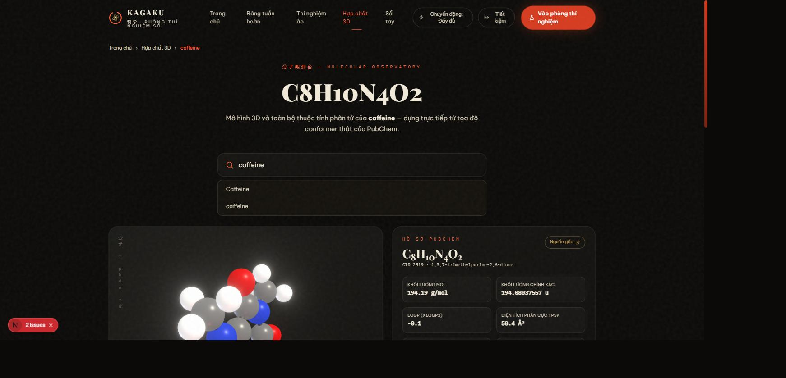
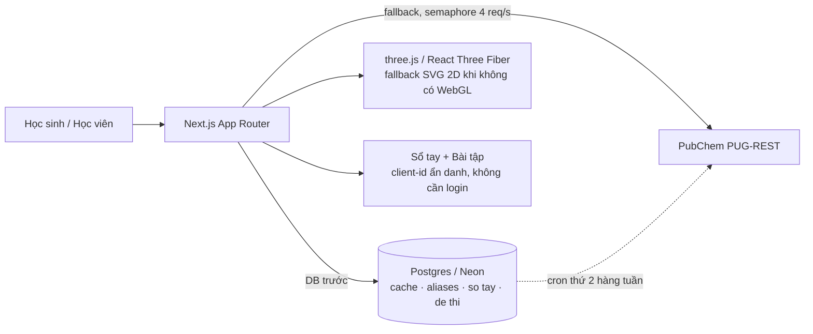

# KAGAKU (科学)

[](https://github.com/minhtai0611/japanese-aesthetic-chemistry-simulation/actions/workflows/ci.yml)

A Vietnamese-language virtual chemistry lab built with Next.js. It renders the 118-element periodic table, 3D molecule/compound viewers, interactive virtual-lab experiments (titration, dilution, phase-change, equation balancing), a saved lab notebook, and a deterministic exercise generator with a teacher mode — styled with a Japanese aesthetic, kanji labels alongside Vietnamese copy.

**Live:** https://japanese-aesthetic-chemistry-simula.vercel.app

## Screenshots

| Hero (3D molecule) | Periodic table |
|---|---|
|  |  |

| Titration room | Molecule observatory |
|---|---|
|  |  |

## Data policy

This app does not fabricate chemistry data. Every element/compound value is sourced directly from [PubChem PUG-REST](https://pubchem.ncbi.nlm.nih.gov/rest/pug) (NCBI, public, no API key) and synced with a controlled cache (`revalidate: 7 days`) — pages are **not** queried live against PubChem on every pageview, in line with [PubChem's usage policy](https://pubchem.ncbi.nlm.nih.gov/docs/pug-rest-tutorial) of staying under 5 requests/second against a shared public server. Simulated calculations (pH, dilution `C₁V₁=C₂V₂`, molarity `n=m/M`, phase transitions, equation balancing via Gauss-Jordan) are real formulas/algorithms computed on top of that real data — never estimated, invented, or delegated to an LLM. See `docs/adr/` for the reasoning behind these decisions in more depth.

### Provenance / certainty

PubChem marks some superheavy elements' standard state as `"Expected to be a ..."` instead of a measured value (too few atoms ever produced to observe bulk phase). `NguyenTo.trangThaiCertainty` / `cauHinhElectronCertainty` (`src/lib/pubchem.ts`) carry that signal through to the UI, which labels those values "Dự đoán" (predicted) instead of presenting them as settled fact — see the periodic table legend and each element's detail page. (`docs/adr/0001-tang-do-tin-cay-du-lieu.md`)

## Architecture



## Số liệu đo được (trước / sau)

Kết quả đo thật trên nhánh này, không phải mục tiêu lý thuyết — lệnh kiểm chứng
đi kèm để tái lập được.

| Hạng mục | Trước | Sau | Lệnh kiểm chứng |
|---|---|---|---|
| Lỗi 5xx trên URL surface | 14 | **0** | `npm run audit:urls` |
| Lỗ hổng npm mức HIGH | 12 | **0** | `npm audit --audit-level=high` |
| Alias tiếng Việt bị sập (500) | 14/39 | **0/39** | `curl .../hop-chat/n%C6%B0%E1%BB%9Bc` → 200 (qua 308) |
| Test tự động (unit) | 0 | **284 PASS** | `npm run test` |
| Test tự động (E2E) | 0 | **6/6 PASS** | `npm run test:e2e` |
| Cân bằng phương trình đúng | — | **50/50** | `npm run test` (`can-bang.test.ts`) |
| Cấu hình electron đúng | — | **118/118** | `npm run test` (`electron-config-118.test.ts`, quét toàn bộ 118 nguyên tố với dữ liệu PubChem thật) |
| Lighthouse Accessibility (cả 3 URL) | — | **100/100** | xem `docs/a11y.md` |
| Lighthouse SEO (cả 3 URL) | — | **100/100** | `npx @lhci/cli autorun` |
| Lighthouse Performance (trang có WebGL) | — | **30-66/100** (dưới ngưỡng kế hoạch) | xem `docs/lighthouse.md` |
| Tương phản màu (WCAG AA) | 3 cặp FAIL | **0/9 FAIL** | `python3 scripts/check-contrast.py` |
| JS tải khi bật "Tiết kiệm" | — | **-40,6%** | đo trên production build, xem `docs/a11y.md` §7 |
| Nguồn dữ liệu tự chế | — | **0** | `grep -rn 'padStart(6, *"F")' src` |
| Tham chiếu AI/LLM trong code | — | **0**\* | `grep -rniE "openai\|anthropic\|embedding\|langchain" package.json src` |

\* Một dòng khớp là chính comment tuyên bố "KHÔNG dùng AI/embedding" — không phải
lời gọi AI thật.

## Stack

- [Next.js](https://nextjs.org) 16 (App Router) + React 19
- [`@react-three/fiber`](https://docs.pmnd.rs/react-three-fiber) / `drei` / `postprocessing` (three.js) for 3D scenes, with an SVG 2D orthographic-projection fallback when WebGL is unavailable
- Tailwind CSS 4
- Drizzle ORM + `pg` targeting Postgres (via `DATABASE_URL`)
- TypeScript 5.9 (strict mode)
- Vitest (unit) + Playwright (E2E) + Lighthouse CI

## Getting started

```bash
npm install
cp .env.example .env   # fill in DATABASE_URL
npm run dev
```

Open [http://localhost:3000](http://localhost:3000).

## Scripts

| Command | Description |
|---|---|
| `npm run dev` | Start the dev server |
| `npm run build` | Production build |
| `npm run start` | Serve the production build |
| `npm run lint` | Lint the codebase |
| `npm run typecheck` | Type-check without emitting |
| `npm run test` | Run the unit test suite (Vitest) |
| `npm run test:cov` | Run tests with coverage |
| `npm run test:e2e` | Run the Playwright E2E suite (`tests/e2e/`) against a local server |
| `npm run audit:urls` | Crawl the alias/compound/element URL surface, report 404s/5xx |
| `npm run db:push` | Push the Drizzle schema to Postgres |
| `npx tsx scripts/db-enable-extensions.ts` | One-time: enable `unaccent`/`pg_trgm` on a new Postgres (run before `db:push`) |
| `npx tsx scripts/seed-compounds.ts` | Seed `compound_cache`/`compound_aliases` from the real PubChem API (see `docs/tim-kiem.md`) |
| `python3 scripts/check-contrast.py` | Verify every text/background color pair meets WCAG AA |
| `npx @lhci/cli autorun` | Run Lighthouse CI against `/`, `/bang-tuan-hoan`, `/hop-chat/caffeine` (see `.lighthouserc.json`) |

## Project structure

- `src/app/` — routes:
  - `/` (home), `/bang-tuan-hoan` (periodic table), `/nguyen-to/[kyhieu]` (element detail)
  - `/hop-chat` (3D compound viewer, SSR'd with a default compound) and `/hop-chat/[ten]` — real, indexable, shareable permalinks per compound (own metadata/canonical/OG image, `generateStaticParams` over the featured list)
  - `/thi-nghiem` (lab hub/landing) plus dedicated routes per room: `/thi-nghiem/pha-che`, `/thi-nghiem/chuan-do`, `/thi-nghiem/chuyen-pha`, `/thi-nghiem/can-bang` — each with its own metadata and code-split bundle
  - `/so-tay` — saved lab notebook (anonymous `client_id` cookie, no login) and `/so-tay/[id]/in` — a print-optimized report per saved entry
  - `/de/tao`, `/de/[ma]`, `/de/[ma]/ket-qua` — teacher creates a deterministic exercise set, students answer with a 6-character code, teacher views results + exports CSV
  - `src/app/opengraph-image.tsx` / `src/app/hop-chat/[ten]/opengraph-image.tsx` — dynamically generated OG images (no static image asset to go stale/404)
  - API routes under `src/app/api/*`
- `src/components/ba-d/` — three.js scene components (hero, compound scene, molecule mesh, 2D SVG fallback).
- `src/components/bang-tuan-hoan/`, `src/components/thi-nghiem/`, `src/components/hop-chat/`, `src/components/so-tay/`, `src/components/de-thi/` — feature UI per route.
- `src/lib/pubchem.ts` — PubChem PUG-REST client (the only source of chemistry data); also resolves CID-only queries and Vietnamese aliases (`src/lib/alias-hop-chat.ts`) before hitting PubChem.
- `src/lib/electron-config.ts` — noble-gas-notation electron shell expansion, used by `pubchem.ts`.
- `src/lib/hoa-hoc/` — pure chemistry math: titration (`chuan-do.ts`), molar mass (`khoi-luong-mol.ts`), equation balancing via exact-rational Gauss-Jordan (`can-bang.ts`), formula parsing (`parser-cong-thuc.ts`).
- `src/lib/de-thi/` — `sinh-de.ts` (mulberry32-seeded exercise generator, pure/testable) and `db.ts` (exercise-set CRUD).
- `src/lib/so-tay.ts`, `src/lib/client-id.ts` — lab notebook persistence and the anonymous client-id cookie.
- `src/lib/nguyen-to.ts` — element name/translation tables.
- `src/lib/site.ts` — site metadata/nav.
- `src/lib/hop-chat-noi-bat.ts`, `src/lib/phong-thi-nghiem.ts`, `src/lib/slug.ts`, `src/lib/dinh-danh-chat.ts` — shared constants/helpers for the compound permalinks and lab rooms (see `docs/adr/0002-*` and `0003-*`).
- `src/lib/tim-kiem.ts` — Vietnamese diacritic-insensitive + typo-tolerant compound search over Postgres (`to_tsvector`/`pg_trgm`, no AI); `/api/goi-y` tries this first, falls back to PubChem autocomplete if the DB is unreachable or has no match.
- `src/lib/dong-bo-hop-chat.ts` — syncs `compound_cache`/`compound_aliases` from real PubChem data; shared by `scripts/seed-compounds.ts` (manual) and `/api/cron/sync` (scheduled, see `vercel.json`).
- `src/app/quan-tri/tu-khoa-thieu/` — token-gated (`QUAN_TRI_TOKEN`) dashboard of search queries with no results, to grow `ALIAS_HOP_CHAT` from real usage instead of guessing.
- `src/db/schema.ts` — Drizzle schema for the internal search/cache layer plus the lab-notebook and exercise-set tables (see `docs/tim-kiem.md`).
- `docs/adr/` — architecture decision records for the non-obvious calls (data-confidence tiers, ASCII slug normalization, the education whitelist, exact-rational equation balancing).
- `tests/unit/` (Vitest) and `tests/e2e/` (Playwright) — see the metrics table above for current pass counts.

## Deployment

Hosted on [Vercel](https://vercel.com) (Hobby tier) with a [Neon](https://neon.tech) Postgres database. Pushes to `master` auto-deploy. `vercel.json` schedules a weekly `/api/cron/sync` re-sync; set `CRON_SECRET` so only Vercel Cron (or someone who knows the secret) can trigger it.

## License

Code: MIT (see `LICENSE`).

**The chemistry data is not this project's copyright.** All element and compound
values are sourced from [PubChem](https://pubchem.ncbi.nlm.nih.gov) (NCBI/NIH) —
data in the public domain of the U.S. government. KAGAKU does not modify,
interpolate, or add any measured values of its own.
